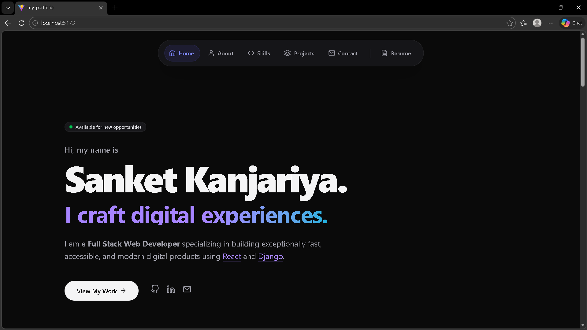
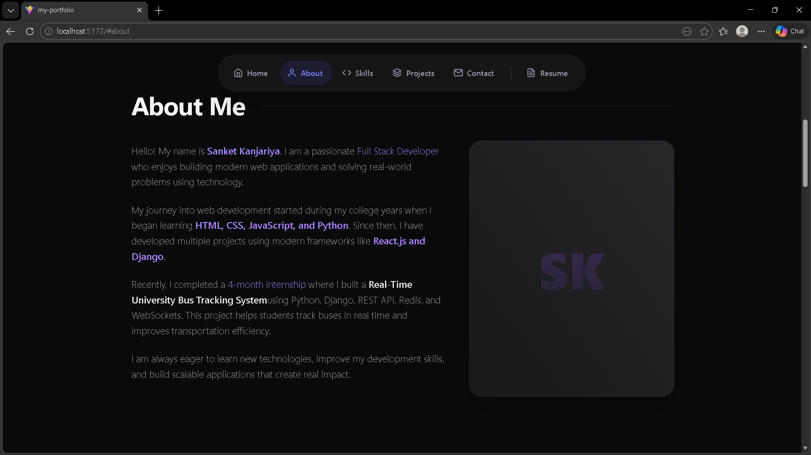
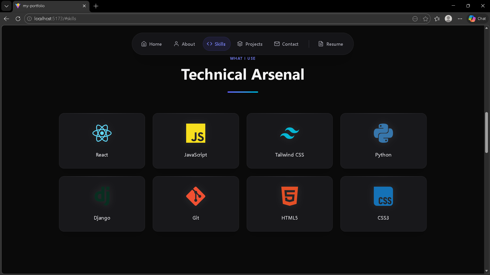
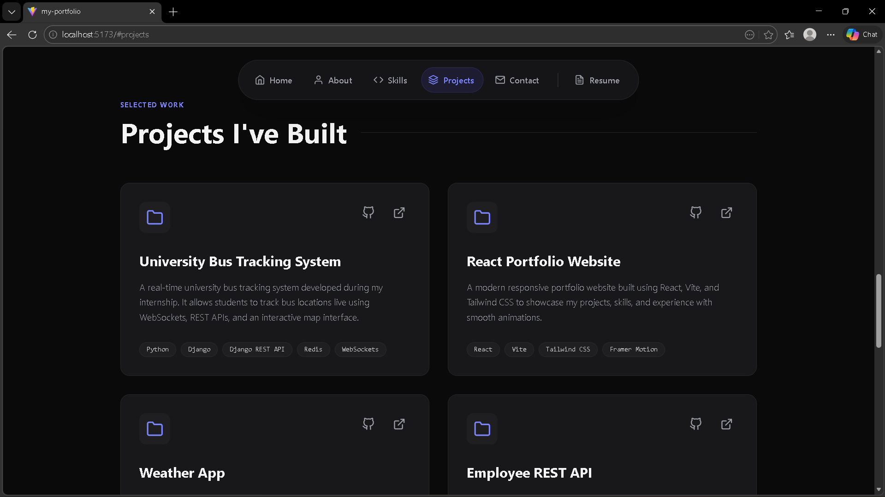
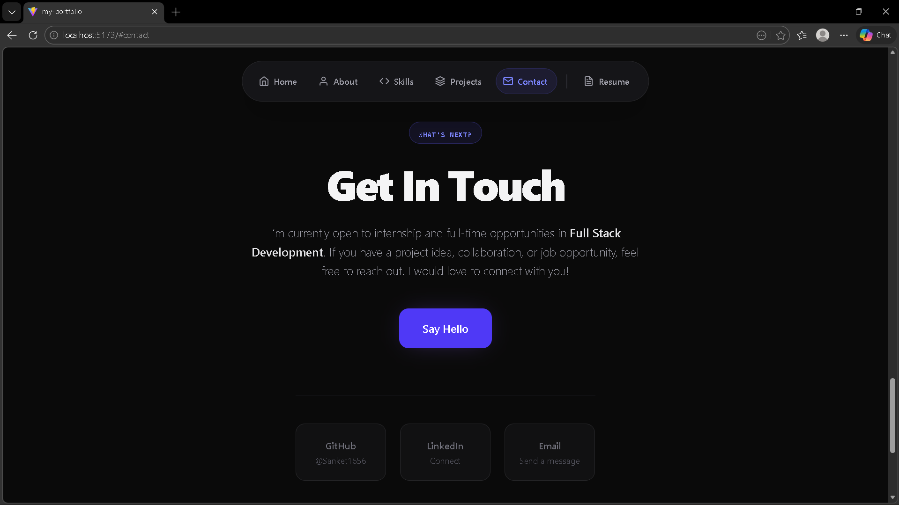

# My Developer Portfolio 🚀

Welcome to my personal portfolio! This project is a modern, responsive, and performant web application built to showcase my projects, skills, and experience as a software developer.

---

# 📌 Project Objective

The objective of this project is to design, develop, and deploy a professional portfolio website using **React**.
The website highlights my projects, technical skills, and contact information while demonstrating **responsive design, performance optimization, and modern frontend development practices**.

---

# 🌐 Live Demo

**Portfolio Website:**
https://sanket-kanjariya.vercel.app/

**Repository:**
https://github.com/Sanket1656/my-portfolio

---

# ✨ Features

### Responsive Design

Carefully crafted to look perfect on **mobile, tablet, and desktop devices**.

### Modern UI

Dark mode aesthetic with gradients, glassmorphism, and smooth micro-animations using **Framer Motion**.

### Performance Optimized

Lazy loading implemented for **React components and images** to ensure fast loading.

### Modular Components

Clean reusable React components such as:

* Hero
* About
* Skills
* Projects
* Contact

### Fast Development

Built using **Vite** for extremely fast development and build performance.

---

# ⚡ Performance Optimization

To improve application performance and loading speed, the following optimizations were implemented:

* **Lazy Loading:** React `lazy()` and `Suspense` used for component code splitting.
* **Image Lazy Loading:** Images load only when they enter the viewport.
* **Production Build Optimization:** Vite minimizes JavaScript and CSS during build.
* **Component-Based Architecture:** Improves maintainability and reduces redundant code.
* **Efficient Animations:** GPU-accelerated animations using Framer Motion.

---

# 🛠 Tech Stack

## Frontend

* React 19
* Vite

## Styling

* Tailwind CSS v4

## Animations

* Framer Motion

## Icons

* React Icons (Feather Icons, Simple Icons)

---

# 📂 Project Structure

```
my-portfolio
│
├── public
│
├── src
│   ├── components
│   │   ├── Hero.jsx
│   │   ├── About.jsx
│   │   ├── Skills.jsx
│   │   ├── Projects.jsx
│   │   └── Contact.jsx
│   │
│   ├── App.jsx
│   └── main.jsx
│
├── index.html
├── package.json
└── README.md
```

---

# ⚙️ Getting Started Locally

Follow these steps to run the project locally.

## 1️⃣ Clone the Repository

```bash
git clone https://github.com/Sanket1656/my-portfolio.git
cd my-portfolio
```

---

## 2️⃣ Install Dependencies

```bash
npm install
```

---

## 3️⃣ Start Development Server

```bash
npm run dev
```

Open in browser:

```
http://localhost:5173
```

---

## 4️⃣ Build for Production

```bash
npm run build
```

Preview production build:

```bash
npm run preview
```

---

# 🚀 Deployment

This project is deployed using **Vercel**, a modern cloud platform for frontend applications.

## Deploy on Vercel

1. Push the code to **GitHub**
2. Go to https://vercel.com
3. Login using **GitHub**
4. Click **Add New → Project**
5. Import your repository

Vercel automatically detects **Vite settings**

Build settings:

```
Build Command: npm run build
Output Directory: dist
```

Click **Deploy**.

After deployment you receive a URL like:

```
https://my-portfolio.vercel.app
```

---

# 🧠 Challenges & Solutions

## 1️⃣ Performance Optimization with Large Component Trees

**Challenge**

As the application grew, the bundle size increased and slightly affected the Time to Interactive (TTI).

**Solution**

Implemented React lazy loading using:

```
React.lazy()
Suspense
```

This split the code into smaller chunks and improved initial load performance.

---

## 2️⃣ Layout Issues from Default Vite Styles

**Challenge**

The default Vite template added:

```
display: flex
min-width
```

to the body element which conflicted with Tailwind layouts.

**Solution**

Removed the conflicting global styles and fully switched to **Tailwind utility classes**.

---

## 3️⃣ Smooth Mobile Menu Animations

**Challenge**

Creating smooth animations for mobile navigation on low-end devices.

**Solution**

Used **AnimatePresence** from Framer Motion with GPU-accelerated transforms:

```
y
opacity
```

This created smooth opening and closing animations.

---

# 📷 Screenshots


Example:

```
screenshots/home.png


screenshots/about.png


screenshots/skills.png


screenshots/projects.png


screenshots/contact.png

```


---

# 👨‍💻 Author

**Sanket Kanjariya**

Software Developer | MERN Stack | Python Django

GitHub
https://github.com/Sanket1656

---

# ⭐ Support

If you like this project, consider giving it a **⭐ on GitHub**.
